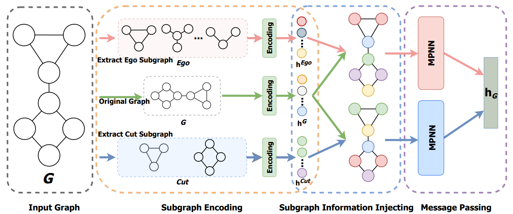

# SAGNN-Substructure-Aware-Graph-Neural-Networks
Official implementation of SAGNN for our AAAI 2023 paper: 
**Substructure Aware Graph Neural Networks**.

 

## Setup 

```
# params
# 4/1/2023, newest packages. 
ENV=gnn_ak
CUDA=11.1
TORCH=1.9.1
PYG=2.0.1

# create env 
conda create --name $ENV python=3.9 -y
conda activate $ENV

# install pytorch 
conda install pytorch=$TORCH torchvision torchaudio cudatoolkit=$cuda -c pytorch -c nvidia -y

# install pyg2.0
conda install pyg=$PYG -c pyg -c conda-forge -y

# install ogb 
pip install ogb

# install rdkit
conda install -c conda-forge rdkit -y

# update yacs and tensorboard
pip install yacs==0.1.8 --force  # PyG currently use 0.1.6 which doesn't support None argument. 
pip install tensorboard
pip install matplotlib
```


## Run SAGNN on ZINC

Download ZINC dataset in https://drive.google.com/drive/folders/1TAoTiA4JndEfdFklJ7ESAibG0t8b8Lar?usp=share_link
and put it in \data\ZINC
### 1. ZINC
#### Train in ZINC with GINEConv
  ```
  python -m train.zinc model.gnn_type GINEConv 
  ```
#### Train in  ZINC with SimplifiedPNAConv
  ```
  python -m train.zinc model.gnn_type SimplifiedPNAConv 
  ```
You can run SAGNN on other datasets by converting the data to suitable format.

#### Test SAGNN on ZINC with GINEConv
Download pretrained neural network weights in https://drive.google.com/drive/folders/1ytwVuJW7RoYaiP4KfyPryebw5-Qt-qo7?usp=share_link 
and put it in \checkpoint\ZINC
```
  python -m train.test_zinc model.gnn_type GINEConv train.checkpoint_path ./checkpoint/ZINC/SAGNN_best_zinc.pt
```

## Citation

#### Please kindly cite this paper if you use the code:
  ```
  @inproceedings{zeng2023substructure,
  title={Substructure Aware Graph Neural Networks},
  author={Zeng, Dingyi and Liu, Wanlong and Chen, Wenyu and Zhou, Li  and Malu Zhang and Qu, Hong },
  booktitle={Proc. of AAAI},
  year={2023}
}
  ```
####


